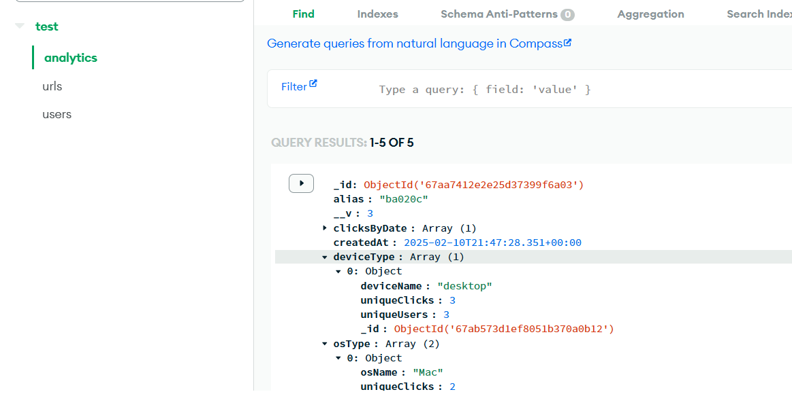

# URL Shortener Application backend

## Deployed URLs

1. https://url-shortener-begm.onrender.com (can be used to test in postman with bearer token from google signIn)
2. https://url-shortener-begm.onrender.com/api-docs/ (Swagger UI)

## Summary

This application allows multiple users to create shorten URLs and track analytics,like no.of clicks , device used and clicks made by each device or ip etc for their created links.

## Details

- Custom URL Shortener API that includes advanced analytics, user authentication via Google Sign-In, and rate limiting. This system will allow users to create short URLs that simplify the sharing of long, complex URLs across various platforms, making it easier for users to distribute links in a concise format.

## Installation

1. Clone the repo:

   ```sh
   git clone https://github.com/geek-ninja/url_shortener.git
   cd url_shortener
   ```

2. Install dependencies:

   ```sh
   npm install
   ```

3. set environment variables:
   - Create a `.env` file in /src folder:
     ```env
     PORT=3000
     DATABASE_ACCESS=mongoBdUrl
     JWT_SECRET=your_jwt_secret
     BASE_SHORTEN_UR=Base url
     REDIS_PASSWORD=Redis password
     REDIS_SOCKET_HOST=Redis host
     REDIS_SOCKET_PORT=Redis port
     FIREBASE_PROJECT_ID=projectId
     FIREBASE_CLIENT_EMAIL=keyConfig
     FIREBASE_PRIVATE_KEY=key
     ```
4. Setting MongoDB Atlas:
   - Create an account for free and get your connection string and add it in your env file.
     
5. Setting Redis:
   - Create an account for free (https://redis.io/try-free/) and get your credentials for node.js.
6. Setting firebase project:
   - Create an account in firebase and create a project and allow necessary permissions to use signin with google popup to get idtoken.
     

## Running the Project

1. **Start the backend server**:

   ```sh
   cd src/
   node server.js
   ```

   The server should now be running at `http://localhost:3000`.

2. **Start the client server to get googleSignin token for testing**:
   ```sh
   cd src/client
   http-server
   ```
   The server should now be running at `http://localhost:8080`.

## API Endpoints examples , rest can be found in swagger

### 1. Shorten a URL (This endpoint has rate limit middleware)

**Endpoint:** `POST /api/shorten`

**Request Body:**

```json
{
  {
  "longUrl":"https://www.youtube.com/watch?v=N31Qi7VOJ3E",
  "customAlias":"ball",
  "topic":"games"
  }
}
```

**Request Headers:**

```json
    "headers": {
        "Authorization": "token got from client side after log in",
        "User-Agent" : "Mozilla/5.0 (Windows NT 10.0; Win64; x64) AppleWebKit/537.36 (KHTML, like Gecko) Chrome/132.0.0.0 Safari/537.36"
    },
```

**Response:**

```json
{
  "shortUrl": "http://myurlshorten.abc",
  "longUrl": "https://www.youtube.com/watch?v=N31Qi7VOJ3E"
}
```

### 2. Redirect to Long Url

**Endpoint:** `GET /api/shorten/:customAlias`

**Request Headers:**

```json
    "headers": {
        "Authorization": "token got from client side after log in",
        "User-Agent" : "Mozilla/5.0 (Windows NT 10.0; Win64; x64) AppleWebKit/537.36 (KHTML, like Gecko) Chrome/132.0.0.0 Safari/537.36"
    },
```

**Response:**

```json
{
  "redirectUrl": "https://www.youtube.com/watch?v=N31Qi7VOJ3E"
}
```

### 3. Overall analytics for all short URLs under a given topic

**Endpoint:** `GET /api/analytics/overall/url`

**Request Headers:**

```json
    "headers": {
        "Authorization": "token got from client side after log in",
        "User-Agent" : "Mozilla/5.0 (Windows NT 10.0; Win64; x64) AppleWebKit/537.36 (KHTML, like Gecko) Chrome/132.0.0.0 Safari/537.36"
    },
```

**Response:**

```json
{
  "totalUrls": 2,
  "totalClicks": 1,
  "uniqueUsers": 1,
  "clicksByDate": [
    {
      "date": "2025-02-13",
      "clickCount": 1
    }
  ],
  "osType": [
    {
      "osName": "Windows",
      "uniqueClicks": 0,
      "uniqueUsers": 0
    }
  ],
  "deviceType": [
    {
      "deviceName": "desktop",
      "uniqueClicks": 1,
      "uniqueUsers": 1
    }
  ]
}
```

## Deployment

- The application is deployed in render a free service , it supports node.js and will fetch your github project to deploy and you can set your env variables as well

## Testing

- For testing Jest has been used to write test case can be found in src/test (sample test cases) and axios has been used to hit apis.

```js
it("user login with proper creds", async () => {
  const res = await axios.get(
    "http://localhost:3030/api/analytics/overall/url",
    {
      headers: {
        Authorization: `Bearer ${yourToken}`,
      },
    }
  );
  expect(res.status).toBe(200);
  expect(res.data).toHaveProperty("totalUrls");
  expect(res.data).toHaveProperty("totalClicks");
  expect(res.data).toHaveProperty("uniqueUsers");
  expect(res.data).toHaveProperty("clicksByDate");
  expect(res.data).toHaveProperty("osType");
  expect(res.data).toHaveProperty("deviceType");
});
```

## Documentations

- For documentations , swagger-ui-express is used.
- deployed url : https://url-shortener-begm.onrender.com/api-docs/
- local url : localhost:3000/api-docs/
  
